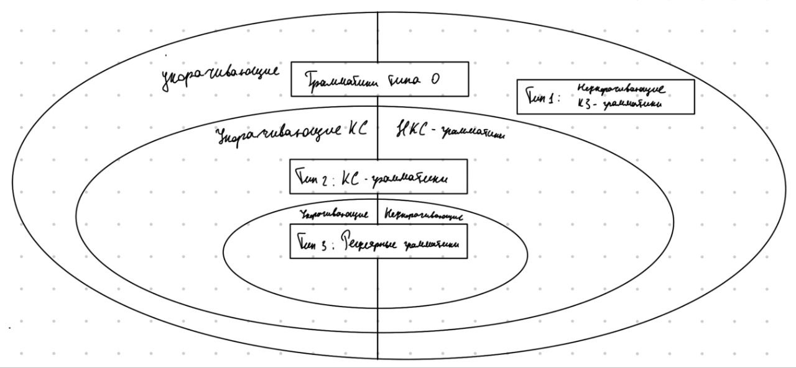
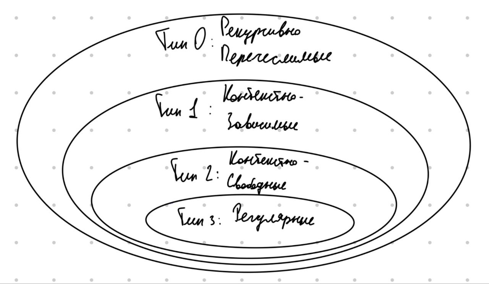

Все грамматики и почти все языки можно разделить на отдельные типы, характеризующие их вид. В зависимости от типа грамматики к ней применимы разные алгоритмы анализа и распознавания языка. 

# Типы грамматик  и языков

В иерархии Хомского описываются 4 типа грамматик, особым образом частично вложенных друг в друга. Типы языков напрямую зависят от типов порождающих их грамматик и определяются правилом "Язык принадлежит **типу i**, если для него **существует** порождающая его грамматика **типа i** и **не существует** грамматики **типа i+1**". При этом, вообще говоря, существуют языки, не представимые грамматиками вообще (доказательство несчётности множества языков представлено в [методичке](https://docs.yandex.ru/docs/view?tm=1729342701&tld=ru&lang=ru&name=3-formalnye_grammatiki_i_jazyki-vmik_mgu-2009.pdf&text=%D0%B2%D0%BE%D0%BB%D0%BA%D0%BE%D0%B2%D0%B0%20%D0%B2%D0%BC%D0%BA%20%D1%84%D0%BE%D1%80%D0%BC%D0%B0%D0%BB%D1%8C%D0%BD%D1%8B%D0%B5%20%D0%B3%D1%80%D0%B0%D0%BC%D0%BC%D0%B0%D1%82%D0%B8%D0%BA%D0%B8&url=https%3A%2F%2Fvmk.ucoz.net%2FFiles%2Fit%2FInformatics%2F3-formalnye_grammatiki_i_jazyki-vmik_mgu-2009.pdf&lr=21735&mime=pdf&l10n=ru&sign=a6213ca3cb10849b89bf96e0572e1a70&keyno=0&nosw=1&serpParams=tm%3D1729342701%26tld%3Dru%26lang%3Dru%26name%3D3-formalnye_grammatiki_i_jazyki-vmik_mgu-2009.pdf%26text%3D%25D0%25B2%25D0%25BE%25D0%25BB%25D0%25BA%25D0%25BE%25D0%25B2%25D0%25B0%2B%25D0%25B2%25D0%25BC%25D0%25BA%2B%25D1%2584%25D0%25BE%25D1%2580%25D0%25BC%25D0%25B0%25D0%25BB%25D1%258C%25D0%25BD%25D1%258B%25D0%25B5%2B%25D0%25B3%25D1%2580%25D0%25B0%25D0%25BC%25D0%25BC%25D0%25B0%25D1%2582%25D0%25B8%25D0%25BA%25D0%25B8%26url%3Dhttps%253A%2F%2Fvmk.ucoz.net%2FFiles%2Fit%2FInformatics%2F3-formalnye_grammatiki_i_jazyki-vmik_mgu-2009.pdf%26lr%3D21735%26mime%3Dpdf%26l10n%3Dru%26sign%3Da6213ca3cb10849b89bf96e0572e1a70%26keyno%3D0%26nosw%3D1&clckid=29be6379)). В таком случае речь будет вестись о **рекурсивно неперечислимых языках**.

## Тип 0

К нему относятся все грамматики с правилами вида $\alpha \rightarrow \beta$, то есть вообще все грамматики.

В случае языков типу 0 принадлежат все рекурсивно перечислимые языки.

## Тип 1

Данный тип описывается двумя эквивалентными способами. \
Грамматики типа 1 относятся к классу **неукорачивающих** и описыватся правилами вида $\alpha \rightarrow \beta$, где $|\alpha| \leq |\beta|$. Исключением из этого ограничения может быть только наличие правила вида $S \rightarrow \epsilon$ при условии, что начальный нетерминал **не встречается ни в одном правиле в правой части**. \
Грамматика типа 1 также определяется **контексто-зависимой грамматикой**, для которой правила описываются чуть сложнее:

$$
\xi_1A\xi_2 \rightarrow \xi_1\gamma\xi_2
$$
$$\begin{aligned}
where\ A \in N \\
\gamma \in (T \cup N)^+\\
\xi_1 \in (T \cup N)^*\\
\xi_2 \in (T \cup N)^*
\end{aligned}
$$

Как видно из определения, любая КЗ-грамматика всегда является неукорачивающей ($\xi_1$ и $\xi_2$ не изменяются, $|A|\{ = 1\} \leq |\gamma|\{ \geq 1\}$), а неукорачивающая, очевидно, описывается этими же правилами и, соответственно, является КЗ. Для КЗ-грамматики также возможно исключение для начального нетерминала.

Язык, порождаемый КЗ или неукорачивающей грамматикой, принадлежит типу 1. 
## Тип 2

Тип 2 грамматик описывается **контекстно-свободными грамматиками**. Её правила выглядят следующим образом:

$$A \rightarrow \beta$$
$$
\begin{aligned}
where\ A \in N \\
\beta \in (T \cup N)^*
\end{aligned}
$$

Логично заметить, что в КС-грамматиках, вообще говоря, допустимо укорачивание. При добавлении ограничения на неубывание длины преобразования получаем **неукорачивающую КС-грамматику**.

Язык, порождаемый КС-грамматикой, принадлежит типу 2. 
## Тип 3

Самый строгий из типов грамматик. Он описывается **регулярными** грамматиками, которые,в свою очередь, делятся на два подкласса - **праволинейные** и **леволинейные** грамматики.

Праволинейная грамматика:

$$A \rightarrow \omega B\ |\ \omega$$
$$
\begin{aligned}
where\ A,\ B \in N \\
\omega \in T^*
\end{aligned}
$$


Леволинейная грамматика:

$$A \rightarrow B \omega\ |\ \omega$$
$$
\begin{aligned}
where\ A,\ B \in N \\
\omega \in T^*
\end{aligned}
$$

Регулярные грамматики описывают один и тот же класс языков. \
С классе регулярных грамматик также выделяют очень важный подкласс **автоматных грамматик**, для которых терминальный блок всегда состоит из одного элемента:

Праволинейная автоматная:

$$A \rightarrow a B\ |\ a$$
$$
\begin{aligned}
where\ A,\ B \in N \\
a \in T
\end{aligned}
$$


Леволинейная автоматная:

$$A \rightarrow  Ba\ |\ a$$
$$
\begin{aligned}
where\ A,\ B \in N \\
a \in T
\end{aligned}
$$


Также, как и для КС-грамматик, дополнительной ограничение на длину преобразования делает регуляргую грамматику неукорачивающей.

Язык, порождаемый регулярной грамматикой, принадлежит типу 3. 

## Вложенности грамматик и языков

В случае грамматик вложенность определяется следующими утверждениями:
+ Любая регулярная грамматика является КС-грамматикой;
+ Любая неукорачивающая КС-грамматика является КЗ-грамматикой;
+ Любая неукорачивающая грамматика является грамматикой типа 0

Таким образом, неукорачивающие подклассы строго вложены друг в друга, а вообще все грамматики разбиваются согласно схеме:



Для укорачивающих КС и регулярных грамматик существует алгоритм преобразования их в неукорачивающие без изменения получаемого из них языка, следовательно без ограничения общности можно говорить о том, что все языки порождаются именно неукорачивающими грамматиками. \
Вообще говоря, этот алгоритм направлен на удаление пустой правой части (алгоритм будет рассмотрен в следующей главе).  Исходя из определений КС и регулярных грамматик можно сделать вывод, что удаления пустой правой части из всех правил (за исключением перехода из начального нетерминала) достаточно для выполнения ограничения длины преобразования. А вот для грамматики типа 0 преобразование не обязательно делает её неукорачивающей.

Пример такой грамматики:
```shell
S  -> ABC
AB -> C
C  -> h
```
Пустых правых частей в ней нет совсем, при этом она не является неукорачивающей.

Так как неукорачивающие грамматики строго вложены друг в друга, множество языков можно представить в виде вложенных типов:
