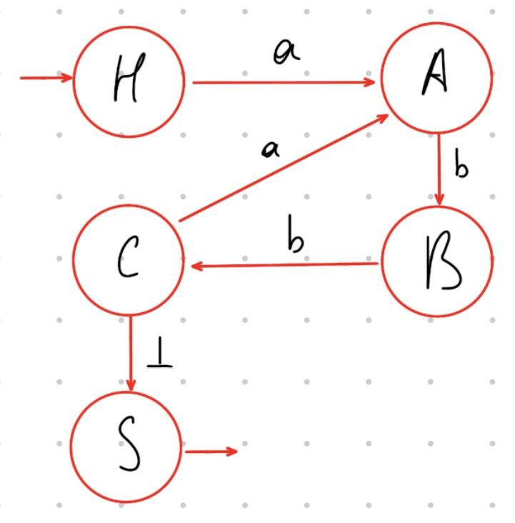
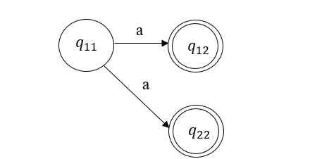
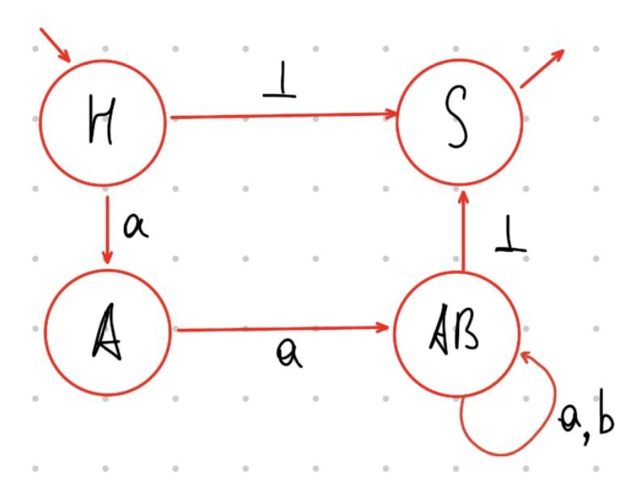
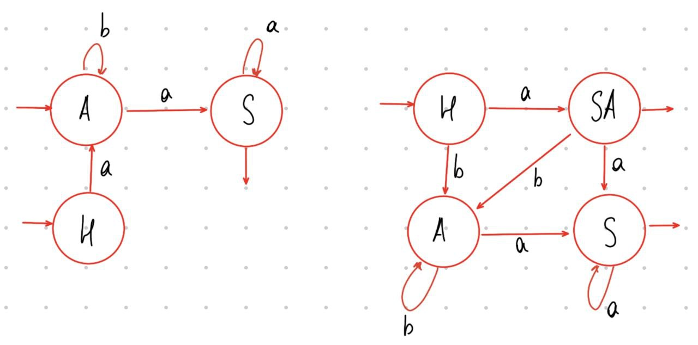
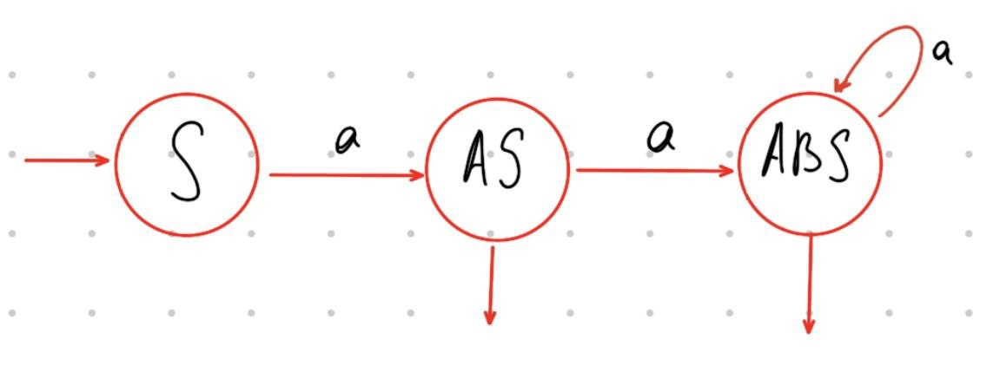

Как уже было сказано, формальные грамматики являются фундаментом алгоритмов работы интерпретаторов и компиляторов. На основе техник разбора формальных языков построена схема анализа и трансляции кода с языка программирования в машинный код.

# Лексический анализатор

Самая первая задача, встающая перед компилятором - проверка корректности входного потока данных (т.е. текста программы). Для этого используется ***лексический анализатор***. Его задача - удалить все комментарии из кода, найти все **лексемы** - отдельные существенные элементы кода - и сопоставить им пары чисел: _тип лексемы_ и _номер лексемы_. Различают 4 типа лексем: идентификаторы, служебные слова, разделители и константы. 

Пример:
```
INPUT:
if (abs > 10)

OUTPUT:
  If     (      abc     >       10       )
(2, 3) (3, 0) (1, 1) (2, 4), (4, 10), (3, 7)
```

После определения лексем лексический анализатор проводит проверку корректности входных данных. Для этого полученную цепочку пар (или несколько цепочек, которые  составляют единое слово ) он анализирует _восходящим разбором_, строящимся на основе **автоматных леволинейных грамматик**.

Для грамматик этого типа существует алгоритм определения того, принадлежит ли
анализируемая цепочка языку, порождаемому этой грамматикой (алгоритм разбора):

Пусть цепочка имеет вид $a_1 a_2 \dots a_n \bot$ , $\bot$ - признак конца строки, дополнительный служебный символ из алфавита терминалов;
 + Первый символ исходной цепочки $a_1 a_2 \dots a_n \bot$  заменяем нетерминалом $A$, для которого в грамматике есть правило вывода $A \rightarrow a_1$ (другими словами, производим свертку терминала $a_1$ к нетерминалу $A$);
 + Затем многократно (до тех пор, пока не считаем признак конца цепочки) выполняем следующие шаги: полученный на предыдущем шаге нетерминал $A$ и расположенный _непосредственно справа от него_ очередной терминал $a_i$ исходной цепочки заменяем нетерминалом $B$, для которого в грамматике есть правило вывода $B \rightarrow Aa_i$ ( $i = \overline{1,n}$ );
 + Если в результате преобразования получается $S$,  изначальное слово принадлежит языку. Иначе нет

# ДКА и НКА

Автоматные грамматики напрямую связаны с **конечными автоматами**, имеющими в качестве состояний нетерминальные символы и производящими переходы по терминальным символам. \
В такой интерпретации принадлежность некоторой цепочки языку, порождаемому грамматикой, равносильно возможности из начального состояния автомата достичь выходного состояния, следуя переходам, соответствующим последовательности нетерминалов цепочки.

---

Пример:

Рассмотрим грамматику такого вида:
```
S -> C_|_
C -> Bb
B -> Ab
A -> Ca | a
```

Построим таблицу переходов состояний: 
 + Строки таблицы будут отвечать исходящим состояниям;
 + Столбцы таблицы будут отвечать переходным символам;
 + Значения таблицы будут отвечать входящим состояниям;

Таблица строится по тройкам вида $A \alpha B$, где $А$ - исходящее состояние, $\alpha$ - переходный символ, $B$ - входящее состояние. \
Поскольку грамматика лево линейная, нетерминалы её левой части отвечают входящим состояниям, а нетерминалы правой части - исходящим состояниям (что логично ложится при понимании, как строится цепочка в такой грамматике: леволинейная грамматика строит её справа налево, то есть с конца в начало, а обработка цепочки делается слева направо, от начала автомата к его конечному состоянию). Для унифицирования действий в таблицу (и, соответственно, в автомат) добавляется дополнительное начальное состояние $H$.


```
__|  a  |  b  | _|_
H |  A  |  -  |  - 
A |  -  |  B  |  -
B |  -  |  C  |  -   
C |  A  |  -  |  S
```

Конечный автомат строится по данной таблице следующим образом:
 + Все нетерминалы отвечают некоторым состояниям автомата, при этом $H$ выступает начальным состоянием, а $S$ - конечным;
 + Все переходы между состояниями описываются согласно вышеуказанной схеме от исходящий ко входящим состояниям с помощью переходных символов;

Итоговый конечный автомат имеет такой вид:



В случае работы с праволинейными грамматиками меняется распределение нетерминалов в таблице (из левой части - исходящие, из правой - входящие), добавляется дополнительное выходное состояние $F$, а при построении автомат направляется от $S$ к $F$.

С помощью таблиц переходом можно преобразовывать праволинейные грамматики в леволинейные и наоборот.

---

Основная трудность таких задач - работа с грамматиками, ассоциированными с ***недетерминированными конечными автоматами*** (НКА). Из курса дискретной математики известно, что НКА характеризуется множеством переходов из одного и того же состояния по одному и тому же переходному элементу. В случае НКА грамматик - переходами из одного нетерминала по одному терминалу в разные нетерминалы.



Пример НКА-грамматики (Одно исходящее состояние, один переходный символ -> несколько входящих состояний):
```
S -> B_|_ | _|_
B -> {Bb} | [Aa]
A -> [Aa] | {Bb} | a
```

Для решения проблемы существует специальный ***алгоритм преобразования НКА-грамматики в ДКА-грамматику***:

 + Таблица переходов заполняется аналогично обычному случаю, при наложении нескольких входящих состояний в одной клетке они записываются единым блоком:

```
__|  a  |  b  | _|_
H |  A  |  -  |  S 
A |  AB |  -  |  -
B |  -  |  AB |  S   
```

 + Для получившихся **блочных состояний** в таблицу вносится отдельная строка, а исходящими состояниями для неё становится объединение строк составляющих её состояний (операция повторяется для всех возникающих блочных состояний):
 
 `AB == A union B`
```
__|  a  |  b  | _|_
H |  A  |  -  |  S 
A |  AB |  -  |  -
B |  -  |  AB |  S   
AB|  AB |  AB |  S   
```

 + Итоговый автомат строится на основе построенной таблицы, где в качестве состояний могут выступать блочные состояния (и, вообще говоря, могут отсутствовать какие-то обычные); если в блочных состояниях оказываются начальное (или конечное) состояния, блочное состояние также становится начальным (или конечным):



# Грамматики с пустой правой частью

В рамках лексического анализа задач с пустой правой частью появиться не может, поскольку в рамках разбора лексем языков программирования не может существовать пустых лексем. Тем не менее, при разборе регулярных грамматик вообще такая задача может попасться. Существует два варианта решения такой задачи: **преобразование грамматики** для удаления пустой правой части (однако это, очевидно, изменит вид грамматики и вид автомата, её описывающего, хотя язык грамматики останется без изменений) или **особая обработка автоматов**: для леволинейных грамматик нетерминалы с переходом в пустую правую часть также будут считаться _начальными состояниями_ автомата, для праволинейных грамматик - _конечными состояниями_ автомата.

---

Пример:

Грамматика
```
S -> Sa | Aa
A -> Ab | a | \epsilon
```

Перобразованная грамматика:
```
S -> Sa | Aa | a
A -> Ab | a | b
```

Таблица переходов грамматики:
```
__|  a  |  b  | \epsilon
H |  A  |  -  |  - 
A |  S  |  A  |  *
S |  S  |  -  |  -   
```

Таблица переходов преобразованной грамматики:
```
__|  a  |  b  | \epsilon
H |  SA |  A  |  - 
A |  S  |  A  |  -
S |  S  |  -  |  -   
SA|  S  |  A  |  -   
```

ДКА грамматики и преобразованной грамматики соответственно:



---

Пример со множеством выходов:

```
S -> aS | aA
A -> aA | aB | \epsilon
B -> aB | aS
```

```
___|  a  |  \epsilon
 S |  SA |  - 
 A |  AB |  *
 B |  BS |  -
 AS| ABS |  *
 AB| ABS |  *
 SB| ABS |  -
ABS| ABS |  *
```



---

Грамматики, ассоциированные с автоматами со множеством входных и выходных состояний, накладывают некоторые ограничения на преобразования грамматик: для ДКА со множеством входов невозможно построить праволинейную грамматику, а для ДКА со множеством выходов - леволинейную грамматику (поскольку начальный нетерминал единственен). 